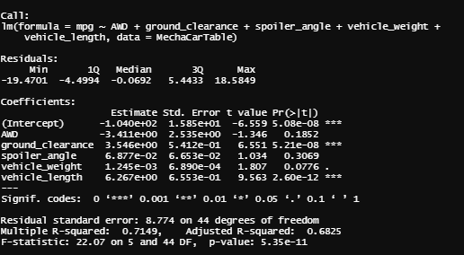

# MechaCar_Statistical_Analysis

## Linear Regression to Predict MPG

  - The variable/coefficients that provided a non random amount of variance to the mpg values are the Intercept, ground_clearance, vehicle_length.
  - We do have a slope and would not be considered zero because we have a Multiple R-squared of .7149.
  -  Depending on our dataset, a significant intercept could mean that the significant features (such as ground_clearance and vehicle_length) may need scaling or          transforming to help improve the predictive power of the model. Alternatively, it may mean that there are other variables that can help explain the variability of our dependent variable that have not been included in our model. Depending on the dataset and desired performance of the model, you may want to change your independent variables and/or transform them and then re-evaluate your coefficients and significance.

## Summary Statistics on Suspension Coils

For the total it does meet design specification however with each lot seperately the only lot to not meet specifications is Lot3. The reason lot 3 does not meet specifications is because the variance goes over 100 since it is at 170.2861224

## T-Tests on Suspension Coils

  - In the total PSI suspension table that we cannont reject the null for Lot1 and Lot2 because the p-value for both are above 0.05 which means that nothing significant is affecting this. As for Lot3 it has a p-value of .04168 so we can reject the null since something is affecting this.

## Study Design: MechaCar vs Competition

The tests that I would do would be on make and model as well as saftey ratings and if it affects it.
The null hypothesis would that model or make would not affect this. The alternative hypothesis would be that make or model does affect this in a significant way.
The statistical test you would use would be a two way ANOVA because of make, model , and competition.
The data for the testing would be the list of make, model , and competitions information of these things as well.
